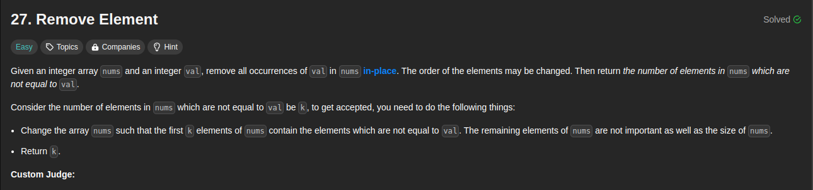

# Intuition

**Approach: 1**

1. Initialize two pointers, `i` and `j`, where `i` represents the current position in the modified array, and `j` iterates through the original array.
2. Iterate through the array using the `j` pointer.
3. If the current element at `nums[j]` is not equal to the given value `val`, copy it to the modified array at position `i` and increment `i`.
4. If the current element is equal to `val`, skip it, effectively removing it from the modified array.
5. The final length of the modified array (`i`) is the new length after removing the specified element.

```java
public int removeElement(int[] nums, int val) {
    int count = 0;
    for (int i = 0; i < nums.length; i++) {
        if (nums[i] != val) {
            nums[count] = nums[i];
            count++;
        }
    }
    return count;
}
```

### Complexity

# Approach-2

## Complexity

# Approach-3

## Complexity

# Approach-4

## Complexity

# Approach-5

## Complexity
