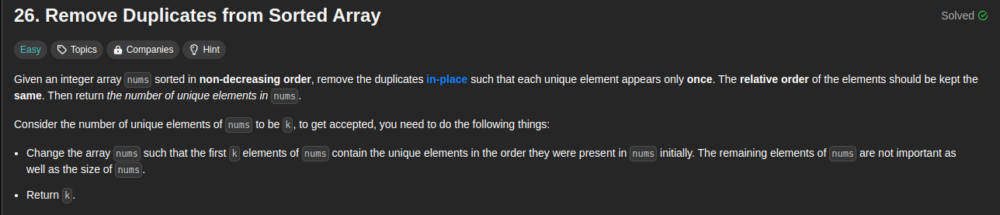

### Approach 1: Two Pointers

```java
public int removeDuplicates(int[] nums) {
    if (nums.length == 0) {
        return 0;
    }

    int slow = 0;

    for (int fast = 1; fast < nums.length; fast++) {
        if (nums[fast] != nums[slow]) {
            slow++;
            nums[slow] = nums[fast];
        }
    }

    return slow + 1;
}
```

### Approach 2: Using Set

```java
public int removeDuplicates(int[] nums) {
    Set<Integer> set = new HashSet<>();

    for (int num : nums) {
        set.add(num);
    }

    int i = 0;
    for (int num : set) {
        nums[i++] = num;
    }

    return set.size();
}
```

### Approach 3: Java 8 Streams

```java
public int removeDuplicates(int[] nums) {
    int[] distinctArray = Arrays.stream(nums).distinct().toArray();
    System.arraycopy(distinctArray, 0, nums, 0, distinctArray.length);
    return distinctArray.length;
}
```

### Approach 4: Using ArrayList

```java
public int removeDuplicates(int[] nums) {
    List<Integer> list = new ArrayList<>();

    for (int num : nums) {
        if (!list.contains(num)) {
            list.add(num);
        }
    }

    for (int i = 0; i < list.size(); i++) {
        nums[i] = list.get(i);
    }

    return list.size();
}
```

These are just different ways to approach the problem. The first approach is the most efficient as it modifies the array in-place using two pointers, which has a time complexity of O(n). The other approaches may have higher time complexity due to the use of additional data structures or array copying.
