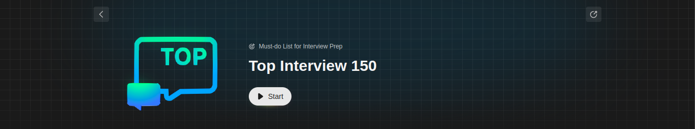

# welcome to Top 150 DSA Interview Questions series

Welcome to the 150 Top DSA Interview Questions repository! This repository is created to assist you in your preparation for Data Structures and Algorithms (DSA) interviews. We understand the significance of mastering DSA for technical interviews, and we've curated a list of 150 top questions to help you excel in your preparation.

## LeetCode Study Plan

We've aligned our repository with a comprehensive LeetCode study plan. The plan is designed to cover a broad spectrum of DSA topics and progressively build your skills. Each question in this repository corresponds to a specific point in the LeetCode study plan, allowing you to seamlessly integrate your preparation.

## Approach

To enhance your problem-solving skills, we provide five different approaches for each question. Understanding multiple solutions not only broadens your perspective but also equips you to tackle diverse problem-solving scenarios. The approaches are accompanied by detailed explanations and analyses, aiding in a deeper comprehension of each solution.

## Time Complexity Analysis

Efficiency is crucial in technical interviews. For every approach presented, we include a time complexity analysis. This will help you evaluate the efficiency of your solutions and make informed decisions during interviews.

## How to Use This Repository

1. **Study Plan Integration:** Align the questions with the corresponding sections of the LeetCode study plan.
2. **Approach Exploration:** Delve into the multiple approaches provided for each question.
3. **Time Complexity Analysis:** Understand the time complexity associated with each approach.
4. **Personal Coding Practice:** Implement the solutions on your own and compare them with the provided solutions.
5. **Language:** JAVA

## Contribution Guidelines

Feel free to contribute by adding more questions, providing alternative solutions, or improving the existing content. Follow these steps to contribute:

1. Fork the repository.
2. Create a new branch for your changes.
3. Make your contributions.
4. Submit a pull request, describing the changes you made and why they are valuable.

Happy coding and best of luck with your DSA interview preparation! 🚀
